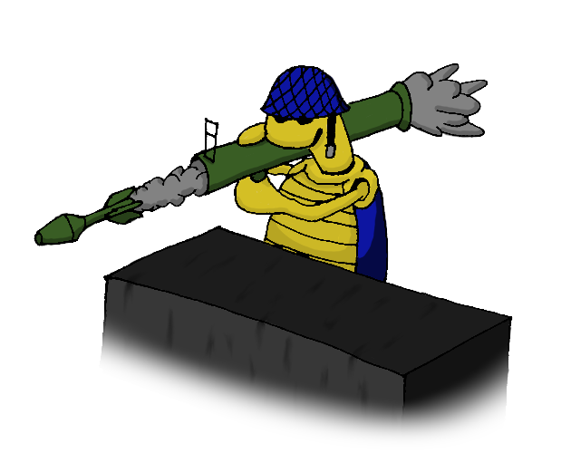
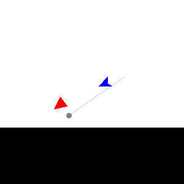
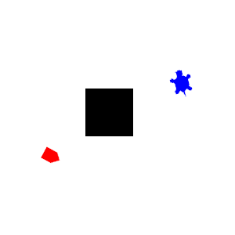
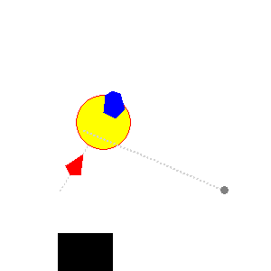
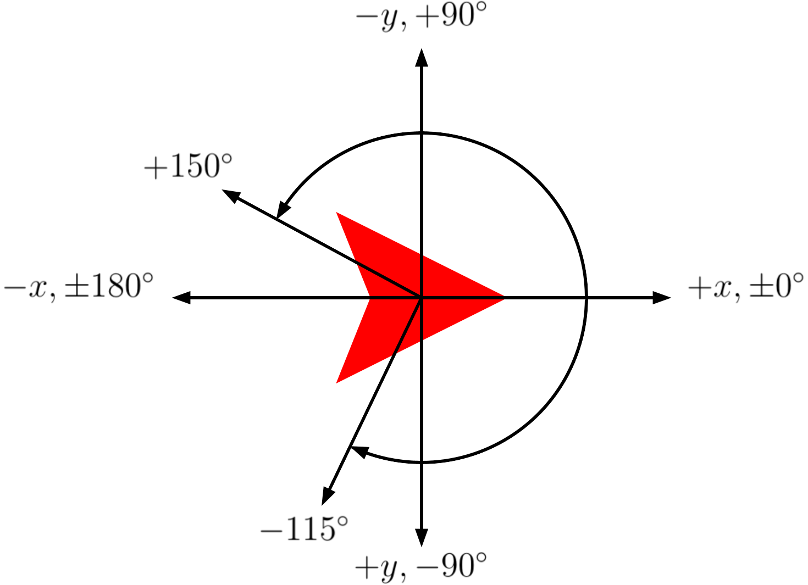

# Combat Turtles

<a href="https://adam-rumpf.itch.io/combat-turtles"></a> <a href="https://github.com/adam-rumpf/combat-turtles/search?l=python"></a> <a href="https://github.com/adam-rumpf/combat-turtles/releases"></a> <a href="https://github.com/adam-rumpf/combat-turtles/blob/master/LICENSE"></a> <a href="https://github.com/adam-rumpf/combat-turtles/commits/master"></a>



A Python module for programming turtle robots to compete against each other in arena combat.

_Combat Turtles_ is meant as a learning tool for intermediate-level [Python](https://www.python.org/) students. It defines a combat game in which programmable [turtle robots](https://en.wikipedia.org/wiki/Turtle_(robot)) move around a battlefield firing missiles to destroy each other. A parent class, `TurtleParent`, defines a variety of basic attributes and methods for these turtle robots, and an `ai/` folder contains a variety of subclasses of this parent class which define different turtle AIs. The main driver script `combatturtles.py` loads selected AI subclasses to compete against each other in combat.

The player can create their own turtle AIs by extending the `TurtleParent` class and overwriting a few key methods. The game is run using discrete step events (at a rate of approximately 30 steps/second), with each turtle defining its actions on a per-step basis. Custom AI submodules (in the form of standalone `.py` files) can be dropped into the `ai/` directory to import the player's AI into the game. Several example and template subclasses are included in this directory to get the player started. See also the [documentation below](#instructions) for a detailed guide to writing custom AIs. Python students might enjoy competing against each other to see whom can come up with the best AI, while Python instructors might consider running a class tournament to encourage students to learn more about object-oriented programming.

The latest release can be found on this project's [itch.io](https://adam-rumpf.itch.io/combat-turtles) page or on the [releases](https://github.com/adam-rumpf/combat-turtles/releases) page. See the author's notes for this project [here](https://adam-rumpf.github.io/programs/combat_turtles.html).

## Game Overview

_Combat Turtles_ is an arena combat game in which two AI-controlled turtle robots fight to the death. Each turtle begins on one side of an arena full of obstacles. Turtles are free to move around the arena, negotiate obstacles, take cover, and aim and fire short-range explosive missiles at each other as their AIs dictate. The object of the game is to destroy the enemy turtle before it destroys you.

  

Turtle AIs are written in Python and imported into the game by adding submodules to its `ai/` folder. Because the game, itself, is written entirely in Python, these AIs can be as simple or as complicated as the player wishes, and can make use of the full range of data structures and modules available in Python. A template and several example AI files are included in this distribution to give you a start, and a large number of built-in attributes and methods have been defined to make the process of AI design faster and easier. See the [instructions](#instructions) below for a complete guide.

## Dependencies

This module was developed for Python 3.8.3.

In an effort to maintain portability it uses only modules from the [Python Standard Library](https://docs.python.org/3/library/), including: `argparse`, `glob`, `inspect`, `math`, `os.path`, `random`, `tkinter`

## Credits

Combat Turtles  
Copyright (c) 2021 Adam Rumpf  
[adam-rumpf.github.io](https://adam-rumpf.github.io/)

Source code released under MIT License  
[github.com/adam-rumpf/turtle-combat](https://github.com/adam-rumpf/turtle-combat)

# Instructions

This section is meant to provide an overview of how the _Combat Turtles_ game works mechanically, and how a player can create and implement their own custom AI submodule.

## Contents

* [Running the Game](#running-the-game)
* [Including a Custom AI Submodule](#including-a-custom-ai-submodule)
  * [Minimal AI Submodule Contents](#minimal-ai-submodule-contents)
  * [Example Submodule](#example-submodule)
  * [Best Practices for AI Submodule Design](#best-practices-for-ai-submodule-design)
* [Gameplay Details](#gameplay-details)
* [Inherited Features](#inherited-features)
  * [Built-In Attributes](#built-in-attributes)
    * [Game Constants](#game-constants)
    * [Own Attributes](#own-attributes)
    * [Opponent Attributes](#opponent-attributes)
  * [Built-In Methods](#built-in-methods)
    * [Action Methods](#action-methods)
    * [Query Methods](#query-methods)

## Running the Game

A game of _Combat Turtles_ can be initiated by running the main driver script `combatturtles.py` found at the root level of this directory.

The public `combat_turtles()` function within this script begins the game, at which point the user will be taken through a series of text-driven menus to choose from the available turtle AIs and arenas. The keyword arguments of this function can be used to specify AI and arena IDs ahead of time, bypassing the need to select them from a menu. In order, the arguments specify: the player 1 AI, the player 2 AI, and the arena ID, so for example `combat_turtles(1, 5, 3)` would attempt to begin a game with AI `1` (`DirectTurtle` by default) as player 1, AI `5` (`TurretTurtle` by default) as player 2, and taking place in arena `3` (wall with gap by default).

Running `combatturtles.py` from the command line automatically initiates a game. Command line arguments can be used to specify the keyword arguments of the `combat_turtles()` function. The usage is as follows:

```
usage: combatturtles.py [-h] [-v] [-f P1] [-s P2] [-a A] [-c LIM]

Initializes a game of Combat Turtles. Command line arguments can be supplied
to specify player AIs and the arena (see below for details). Excluding any of
these arguments will prompt the user to specify them on startup.

Note that the player AIs are indexed alphabetically, which may cause indices
to change as new modules are added to the ai/ directory.

optional arguments:
  -h, --help            show this help message and exit
  -v, --version         show program's version number and exit
  -f P1, --first P1     player 1 AI index
  -s P2, --second P2    player 2 AI index
  -a A, --arena A       arena index
  -c LIM, --cutoff LIM  iteration cutoff (default: unlimited)

See full documentation online at <adam-rumpf.github.io/combat-turtles>.
```

In both cases the turtle AIs are indexed alphabetically beginning with `0`, which may change as more AI modules are added to the `ai/` directory. If a given ID is unspecified or invalid, the user will be asked to specify a value in the text-driven menu.

## Including a Custom AI Submodule

AI submodules are located in the `ai/` folder. Any `.py` file in this folder whose name does not begin with an underscore (`_`) is recognized by the game as an AI submodule, and will be loaded by the main driver when the `combat_turtles()` function is run.

### Minimal AI Submodule Contents

See the included `_template.py` file in the `ai/` folder for a template which includes the basic structure of a valid AI submodule, as well as documentation of the available attributes and methods. The following features are essential for any AI submodule:
* Import `game.tcturtle`, along with any modules required by your custom AI.
* The submodule must define a `class` named `CombatTurtle` which extends `game.tcturtle.TurtleParent`.
* The `class_name()`, `class_desc()`, and `class_shape()` static methods should all be overwritten to define the AI's name string, a brief description string, and an integer index for its shape (or a tuple of radii/angles to define a custom shape in polar coordinates). Note that the shape defines only how the turtle is displayed, and has no effect on the collision detection.
* The `setup()` method should be overwritten with any special initialization code required by the AI. This method is called exactly once, before the first step event of the game.
* The `step()` method should be overwritten with the AI's step event code (this method is called once per step event). This is likely to be the heart of your AI, as it defines all of the decisions that your turtle makes within a step.

### Example Submodule

The included submodules in the `ai/` folder all define very simple turtle AIs that can be looked to as examples. Here we will consider the submodule named "DirectTurtle", defined in `direct.py`. Excluding some of the docstrings, this is the entire submodule:

```python
import game.tcturtle

class CombatTurtle(game.tcturtle.TurtleParent):
    
    def class_name():
        return "DirectTurtle"

    def class_desc():
        return "Moves directly towards opponent and ignores obstacles."

    def class_shape():
        return 0

    def setup(self):
        pass

    def step(self):
        # Turn towards opponent
        self.turn_towards()

        # Move towards opponent (or away if too close)
        if self.distance() > 4*self.missile_radius:
            self.forward()
        else:
            self.back()

        # Shoot if facing opponent and there is line of sight
        if (self.can_shoot and
            abs(self.relative_heading_towards()) <= 10 and
            self.line_of_sight()):
            self.shoot()
```

To explain, it begins my importing `game.tcturtle` and defining a class called `CombatTurtle` which extends `game.tcturtle.TurtleParent`, as is required for all AI submodules.

The three static methods `class_name()`, `class_desc()`, and `class_shape()` define the turtle's name, brief description, and shape index, respectively.

The `setup()` method is overwritten here but is empty because this particular AI does not require any special initialization code. Note that we could have easily left this method out without affecting anything since the `TurtleParent` class' `setup()` method is also just a placeholder.

Finally the `step()` method is overwritten to define this turtle's extremely simplistic AI behavior, which consists of only three directives followed in each step:
* First it calls `self.turn_towards()` to attempt to turn itself towards its opponent.
* Then it decides whether to attempt to move towards or away from its opponent based on its current distance, `self.distance()`, from the opponent. Its distance cutoff is based on the explosive radius of a missile, `self.missile_radius`. If it is sufficiently far away from the opponent, it moves forward at full speed with `self.forward()`, and otherwise, it reverses at full speed with `self.backward()`.
* Finally it decides whether to attempt to shoot, doing so if and only if three conditions are all met: its missile must not be on cooldown (`self.can_shoot`), it must be within `10` degrees of facing the opponent (`abs(self.relative_heading_towards()) <= 10`), and it must have a clear line of sight to the opponent (`self.line_of_sight()`). If all of these are `True`, then it fires a missile by calling `self.shoot()`.

Of course this is an incredibly basic AI, but this example illustrates how simple AI submodules can be. The main body of the program contained in the `step()` method is less than 10 lines of code. If you are just starting out with this program, a good place to start might be to think of ways to improve the example AIs. Get creative and have fun!

### Best Practices for AI Submodule Design

You are free to include any additional methods and attributes as part of your custom AI class, or even additional classes. For safety, it is recommended to restrict the AI to a single file, to import only modules from the [Python Standard Library](https://docs.python.org/3/library/), and to avoid defining methods or attributes whose names begin with an underscore (`_`) since the `TurtleParent` class contains a large number of private members.

You **should not** attempt to overwrite or access any attributes or methods of the `TurtleParent` class aside from those mentioned [above](#minimal-ai-submodule-contents) for overwriting or those mentioned [below](#inherited-features) for accessing. Doing so could break some of the internal workings of the game, or could give the AI an unfair advantage by allowing it to override rules such as the built-in movement limitations. Instead, your turtle's actions should be prompted through use of the inherited [action methods](#action-methods) described below.

A large number of public attributes and methods are inherited from the `TurtleParent` class in order to make AI design easier. See [below](#inherited-features) for a full listing. In particular, attributes exist for accessing [constants](#game-constants) that define the game, your turtle's [own state](#own-attributes), and your [opponent's state](#opponent-attributes), while methods exist for [taking actions](#action-methods) and [gathering information](#query-methods) about the game (such as how far apart the turtles are and whether there is a direct line of sight between them).

Note that computationally intensive AI modules may cause the game to slow down. For this reason, steps may not actually occur at a constant rate, and so your AI should not rely on real time in any way, instead counting step events (which is what all of the built-in game objects do). The inherited `self.time` attribute automatically keeps track of the current step number.

## Gameplay Details

The game takes place in an `800` by `800` pixel arena with one combat turtle placed on either side. At any given time, each turtle has a well-defined position (as a pair of integer pixel coordinates) and heading (as an integer heading between `-179` and `180`) which change as the turtles move and turn. The `TurtleParent` class defines some inherited attributes that can be used to access a turtle's [own position](#own-attributes) or the [opponent's position](#opponent-attributes).

The coordinate system is defined so that the origin of the arena is at the top left, meaning that the positive y-direction is down, the negative y-direction is up, the positive x-direction is right, and the negative x-direction is left. Headings are always normalized to take values in the interval `(-180,180]` with `0` representing east, `90` representing north, `-90` representing south, and `180` representing west. Headings "wrap around" during calculations, so as a turtle turns counterclockwise its heading value increases, eventually wrapping around from `180` to `-179`, and as a turtle turns clockwise its heading value decreases, eventually wrapping around from `-179` to `180`. The following diagram summarizes how the coordinates and headings are set up:



The game begins with both turtles running their `setup()` methods, after which a step event occurs at a rate of approximately 30 steps per second (although this rate is not fixed and may slow down if either turtle AI requires expensive computations). Turtles have no "momentum", meaning that their linear speeds and rotational speeds are both set to zero at the beginning of each step, so in order for a turtle to move continuously it must be given a movement instruction _every step_. After these internal attributes are reset, each turtle's `step()` method is called. If this method included any [movement or shooting](#action-methods) instructions, and the movement or shooting is allowed by the game rules, then the turtle is moved or a missile is fired at the end of the step.

Specifically, the following actions are taken, in order, by the turtle during each step:
1. The turtle's speed and turning speed are set to zero, and its shooting instruction is set to `False`.
1. The turtle's missile cooldown is decremented.
1. The turtle's user-defined `step()` method is called, during which movement and shooting instructions can be issued.
1. The turtle turns as instructed.
1. The turtle moves forward or backward as instructed.
1. The turtle shoots if instructed to.
1. All missile objects move, all graphics update, and all step counts are incremented.

Some arenas contain block objects as obstacles. Turtles cannot move through blocks, nor can they move outside of the arena's boundaries, and attempting to move into a block limits the turtle's movement (although they can still "slide along" the boundary of a block by attempting to move into it at an angle). Missiles immediately explode on contact with a block or an arena boundary. The `TurtleParent` class defines some [inherited methods](#query-methods) that can be used to determine whether a given coordinate is free or not and whether the turtle has a clear line of sight to a given coordinate.

Missiles are fired in the direction that the turtle was facing when its `self.shoot()` method was called. A missile travels at a constant speed in a straight line until either colliding with an obstacle or arena boundary, until passing within a proximity distance of the opponent turtle, or until reaching a maximum distance cutoff. In any of these events, the missile explodes, dealing `20` damage to any turtle within its explosive radius (including the turtle that fired it). As soon as a turtle fires a missile, it enters a cooldown phase where it is not allowed to shoot again for a set number of steps. There are inherited attributes which can be used to access the constants that define a [missile's behavior](#game-constants) as well as the turtle's own [cooldown status](#own-attributes).

Each turtle begins with `100` health, and the goal of the game is to reduce the opponent to `0` health. If both turtles reach `0` health during the same step (which could occur if a single explosion hits them both) then the game ends in a tie. The main driver function `combat_turtles()` has an optional cutoff argument to place a time limit (as a number of steps) on the simulation. If the time limit is reached before either turtle dies, then the winner is the turtle with more health (if both have equal health the the game ends in a tie).

## Inherited Features

This section describes the attributes and methods built into the `TurtleParent` class for use in custom AI subclasses. In defining a subclass you are free to add your own methods and attributes, as long as they do not conflict with any of the built-in members (except for those meant for overwriting as [described above](#minimal-ai-submodule-contents)).

### Built-In Attributes

The following is a list of attributes available for use in custom turtle AIs. All should be treated as read-only. Most are constant, although some are automatically updated to reflect the current state of the game.

#### Game Constants

The following is a list of game-defining constants.

* `self.max_speed` -- Maximum movement speed of a turtle (px/step), and the default speed of the [movement methods](#action-methods).
* `self.max_turn_speed` -- Maximum turning speed of a turtle (deg/step), and the default speed of the [turning methods](#action-methods).
* `self.shoot_delay` -- Length of cooldown between consecutive missile shots (steps).
* `self.missile_speed` -- Constant travel speed of missiles (px/step).
* `self.missile_range` -- Maximum range of missiles (px/step), after which they automatically explode.
* `self.missile_proximity` -- Proximity range of missiles (px). A missile explodes if it passes within this distance of the opponent turtle.
* `self.missile_radius` -- Explosive radius of missiles (px). When a missile explodes it deals damage to all turtles within this range (including the turtle that fired it).
* `self.missile_damage` -- Amount of damage caused by a missile (hp).
* `self.arena_left` -- Left boundary of the arena (px), representing the minimum allowed x-coordinate.
* `self.arena_right` -- Right boundary of the arena (px), representing the maximum allowed x-coordinate.
* `self.arena_bottom` -- Bottom boundary of the arena (px), representing the minimum allowed y-coordinate. Note that, due to the origin's position at the top left of the arena, this actually corresponds to the top of the screen.
* `self.arena_top` -- Top boundary of the arena (px), representing the maximum allowed y-coordinate. Note that, due to the origin's position at the top left of the arena, this actually corresponds to the bottom of the screen.

#### Own Attributes

The following is a list of attributes which describe the turtle's own state.

* `self.x` -- Horizontal coordinate (px).
* `self.y` -- Vertical coordinate (px).
* `self.position` -- Tuple of coordinates (px). Equivalent to `(self.x, self.y)`.
* `self.heading` -- Current heading (deg). Headings are always normalized to the interval `(-180,180]` with `0` indicating east, `90` indicating north, `180` indicating west, and `-90` indicating south.
* `self.speed` -- Current speed (px/step). Note that a turtle's speed is reset to `0` at the beginning of each step and can only become nonzero after the turtle's [movement methods](#action-methods) have been called.
* `self.turn_speed` -- Current turning speed (deg/step). Note that a turtle's turning speed is reset to `0` at the beginning of each step and can only become nonzero after the turtle's [turning methods](#action-methods) have been called.
* `self.health` -- Current health (out of `100`).
* `self.cooldown` -- Length of cooldown until this turtle can shoot again (steps). The turtle can shoot if and only if this value is `0`.
* `self.can_shoot` -- Whether this turtle is able to shoot (`True` if so, `False` if not). Equivalent to `self.cooldown == 0`.
* `self.time` -- Number of steps that have passed since the beginning of the game. Begins at `0` and increments by `1` at the end of each step event.

#### Opponent Attributes

The following is a list of attributes which describe the opponent turtle's state. Both turtles act simultaneously during the step event, and so these attributes are based on the opponent's attributes as of the end of the previous step (with the exception of the `self.other_cooldown` and `self.other_can_shoot` attributes, which are up-to-date for the current step).

* `self.other_x` -- Opponent's previous horizontal coordinate (px).
* `self.other_y` -- Opponent's previous vertical coordinate (px).
* `self.other_position` -- Tuple of opponent's previous coordinates (px). Equivalent to `(self.other_x, self.other_y)`.
* `self.other_heading` -- Opponent's previous heading (deg). Headings are always normalized to the interval `(-180,180]` with `0` indicating east, `90` indicating north, `180` indicating west, and `-90` indicating south.
* `self.other_speed` -- Opponent's previous speed (px/step).
* `self.other_turn_speed` -- Opponent's previous turning speed (deg/step).
* `self.other_health` -- Opponent's previous health (out of `100`).
* `self.other_cooldown` -- Length of cooldown until the opponent can shoot again (steps), as of the current step. The opponent can shoot if and only if this value is `0`.
* `self.other_can_shoot` -- Whether the opponent is able to shoot during the current step (`True` if so, `False` if not). Equivalent to `self.other_cooldown == 0`.

### Built-In Methods

The following is a list of built-in methods available for use in custom turtle AIs, although you are encouraged to write your own as you extend the class.

#### Action Methods

The following is a list of void methods which cause the turtle to perform actions. The main purpose of the `step()` method that defines the turtle's AI is to determine, for each step, which actions to attempt to take.

Note that these methods do not, by themselves, actually cause the turtle to move or shoot: they all set the values of hidden internal variables that specify what the turtle will try to do during the step event. The actual movement is taken care of with hidden internal methods that apply game rules such as enforcing collisions and missile cooldown.

Also note that turtles begin each step with no movement instructions. If you want your turtle to continuously move, it must be given movement instructions _every step_.

* `self.forward([rate])` -- Attempts to move the turtle forward in its current direction. Turtles are blocked by the arena's boundaries and block objects. The optional `rate` argument can take any value between `-1` and `1`, and indicates the fraction of the turtle's maximum speed (`self.max_speed`) to travel at, with `1` indicating full speed forward, `0` indicating no movement, `-1` indicating full speed backward, and intermediate values indicating intermediate speeds.  
Aliases: `forward`, `fd`
* `self.backward([rate])` -- Analogous to `self.forward()`, but with positive `rate` indicating backward movement and negative `rate` indicating forward movement.  
Aliases: `backward`, `back`, `bk`
* `self.left([rate])` -- Turns the turtle left (counterclockwise). The optional `rate` argument can take any value between `-1` and `1`, and indicates the fraction of the turtle's maximum turning speed (`self.max_turn_speed`) to turn at, with `1` indicating full speed counterclockwise, `0` indicating no turning, `-1` indicating full speed clockwise, and intermediate values indicating intermediate turning speeds.  
Aliases: `left`, `lt`
* `self.right([rate])` -- Analogous to `self.left()`, but with positive `rate` indicating clockwise turning and negative `rate` indicating counterclockwise movement.  
Aliases: `right`, `rt`
* `self.turn_towards([args])` -- Turns the turtle as far as possible to face a given target, either at maximum speed if it cannot be reached in one step, or at a fraction of maximum speed if it is possible to face the target directly within one step. The target depends on the inputs:
  * `self.turn_towards()` -- Turn to face the opponent turtle.
  * `self.turn_towards(int)` -- Turn to get heading to match a given heading (deg).
  * `self.turn_towards(tuple)` -- Turn to face a given coordinate tuple (px, px).

  Aliases: `turn_towards`, `turn_toward`, `turnto`
* `self.shoot()` -- Fires a missile in the turtle's current direction. Missiles move at a constant speed until either colliding with a wall or block, getting close enough to the opponent turtle (`self.missile_proximity`), or after traveling a certain distance (`self.missile_range`), and which point they explode, dealing damage (`self.missile_damage`) to any turtle (including the one that fired it) within its explosive radius (`self.missile_radius`). Does nothing if the turtle is still on cooldown from the last shot.  
Aliases: `shoot`, `fire`

#### Query Methods

The following is a list of methods which return information about the current state of the game, including the turtle's own position, the other turtle's position, and information about the arena. These are similar to the [own attributes](#own-attributes) and [opponent attributes](#opponent-attributes) above, but implemented as methods rather than attributes since they require (potentially optional) arguments.

* `self.distance([args])` -- Calculates Euclidean distances between coordinates (px). The distance calculated depends on the inputs:
  * `self.distance()` -- Distance from self to opponent.
  * `self.distance(tuple)` -- Distance from self to a given coordinate tuple (px, px).
  * `self.distance(tuple, tuple)` -- Distance between a pair of given coordinate tuples (px, px).

  Aliases: `distance`, `dist`
* `self.relative_position([target])` -- Calculates the relative position from this turtle to a target coordinate (px, px), meaning the change in this turtle's position required to reach the target coordinate.  
If given no argument, the opponent's position is used.  
Aliases: `relative_position`, `relpos`
* `self.heading_towards([target])` -- Calculates the heading from this turtle to a target coordinate (deg), meaning the direction required to move from this turtle's position to the target coordinate. Headings are normalized to the interval `(-180,180]` with `0` indicating east, `90` indicating north, `180` indicating west, and `-90` indicating south.  
Similar to `self.relative_heading_towards()`, but does not take this turtle's current heading into consideration.  
If given no argument, the opponent's position is used.  
Aliases: `heading_towards`, `heading_toward`, `towards`, `toward`
* `self.relative_heading_towards([target])` -- Calculates the change in heading required to turn this turtle to face a target coordinate (deg), meaning the minimum angle that this turtle would need to turn in order to face the target. Positive headings indicate counterclockwise turning while negative headings indicate clockwise turning.  
Similar to `self.heading_towards()`, but gives a heading relative to this turtle's current heading.  
If given no argument, the opponent's position is used.  
Aliases: `relative_heading_towards`, `relative_heading_toward`
* `self.free_space(coord)` -- Determines whether or not the given coordinate is free of obstacles (`True` if inside the arena and free of obstacles, `False` if not). The coordinates for which this returns `True` are exactly the coordinates which turtles and missiles are allowed to occupy.  
Aliases: `free_space`, `free`
* `self.line_of_sight([target])` -- Determines whether or not there is a line of sight between this turtle and a target coordinate (`True` if so, `False` if not). A line of sight implies that, if this turtle were to immediately fire a missile while facing the specified coordinate, the missile would reach the target without obstruction from any block objects.  
If given no argument, the opponent's position is used.  
Aliases: `line_of_sight`, `los`
